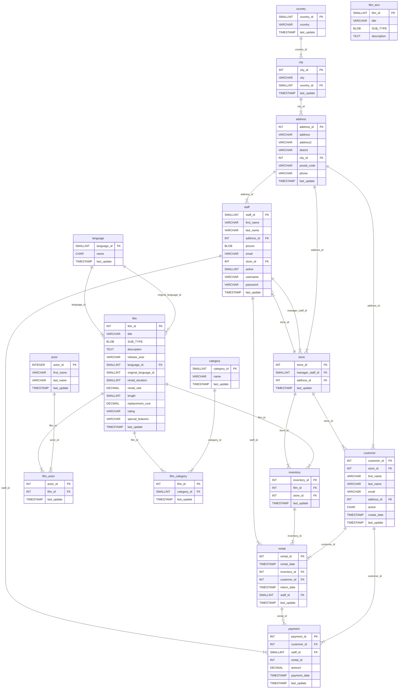

# Diagrama de la base de datos Sakila

```mermaid
erDiagram 
actor { 
INTEGER actor_id PK 
VARCHAR first_name 
VARCHAR last_name 
TIMESTAMP last_update
}

address { 
INT address_id PK 
VARCHAR address 
VARCHAR address2 
VARCHAR district 
INT city_id FK 
VARCHAR postal_code 
VARCHAR phone 
TIMESTAMP last_update
}

category { 
SMALLINT category_id PK 
VARCHAR name 
TIMESTAMP last_update
}

city {
 INT city_id PK 
 VARCHAR city 
 SMALLINT country_id FK 
 TIMESTAMP last_update
}

country { 
 SMALLINT country_id PK 
 VARCHAR country 
 TIMESTAMP last_update
}

customer { 
 INT customer_id PK 
 INT store_id FK 
 VARCHAR first_name 
 VARCHAR last_name 
 VARCHAR email 
 INT address_id FK 
 CHAR active 
 TIMESTAMP create_date 
 TIMESTAMP last_update
 }
 
 film { 
  INT film_id PK 
  VARCHAR title 
  BLOB SUB_TYPE 
  TEXT description 
  VARCHAR release_year 
  SMALLINT language_id FK 
  SMALLINT original_language_id 
  SMALLINT rental_duration 
  DECIMAL rental_rate 
  SMALLINT length 
  DECIMAL replacement_cost 
  VARCHAR rating 
  VARCHAR special_features 
  TIMESTAMP last_update
}

film_actor { 
 INT actor_id PK 
 INT film_id FK 
 TIMESTAMP last_update
}

film_category { 
 INT film_id PK 
 SMALLINT category_id FK 
 TIMESTAMP last_update
}

film_text { 
 SMALLINT film_id PK 
 VARCHAR title 
 BLOB SUB_TYPE TEXT description
}

inventory {
 INT inventory_id PK
 INT film_id FK 
 INT store_id FK 
 TIMESTAMP last_update
}

language { 
 SMALLINT language_id PK 
 CHAR name 
 TIMESTAMP last_update
}

payment { 
 INT payment_id PK 
 INT customer_id FK 
 SMALLINT staff_id FK 
 INT rental_id 
 DECIMAL amount 
 TIMESTAMP payment_date
 TIMESTAMP last_update
}

rental { 
 INT rental_id PK
 TIMESTAMP rental_date
 INT inventory_id FK
 INT customer_id FK
 TIMESTAMP return_date 
 SMALLINT staff_id FK 
 TIMESTAMP last_update
}

staff { 
 SMALLINT staff_id PK 
 VARCHAR first_name 
 VARCHAR last_name 
 INT address_id FK 
 BLOB picture 
 VARCHAR email 
 INT store_id 
 FK SMALLINT active 
 VARCHAR username 
 VARCHAR password 
 TIMESTAMP last_update
}

store {
 INT store_id PK
 SMALLINT manager_staff_id FK
 INT address_id FK
 TIMESTAMP last_update
}

actor ||--|{ film_actor : actor_id
address ||--|{ customer : address_id
address ||--|{ staff : address_id
address ||--|{ store : address_id
category ||--|{ film_category : category_id
city ||--|{ address : city_id
country ||--|{ city : country_id
customer ||--|{ payment : customer_id
customer ||--|{ rental : customer_id
film ||--|{ film_actor : film_id
film ||--|{ film_category : film_id
film ||--|{ inventory : film_id
inventory ||--|{ rental : inventory_id
language ||--o{ film : original_language_id
language ||--|{ film : language_id
rental ||--o{ payment : rental_id
staff ||--|{ payment : staff_id
staff ||--|{ rental : staff_id
staff ||--|{ store : manager_staff_id
store ||--|{ customer : store_id
store ||--|{ inventory : store_id
store ||--|{ staff : store_id

```