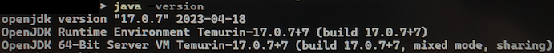

## 1. Introducción a Visual Studio Code

**Visual Studio Code (VS Code)** es un editor de código fuente desarrollado por Microsoft, que ha ganado popularidad entre desarrolladores de software por ser ligero, flexible y altamente personalizable. Está diseñado para ser una herramienta poderosa para escribir, depurar y gestionar proyectos de software, y es especialmente útil para estudiantes de desarrollo de software.

**Características principales de Visual Studio Code**:

* **Editor de código ligero y rápido:** Aunque Visual Studio Code es muy completo, sigue siendo rápido y no consume muchos recursos, lo que lo hace ideal para estudiantes que trabajan con diferentes lenguajes y no cuentan con equipos de alto rendimiento.
* **Soporte para múltiples lenguajes**: VS Code soporta una gran cantidad de lenguajes de programación de manera nativa (JavaScript, Python, C++, Java, HTML, CSS, etc.), y se pueden añadir más a través de extensiones, lo que lo convierte en una herramienta versátil para cualquier curso de programación.
* **Integración de Git**: Visual Studio Code tiene soporte integrado para Git, lo que permite a los estudiantes gestionar el control de versiones sin necesidad de salir del entorno de desarrollo. Esto es esencial para aprender prácticas profesionales de colaboración en proyectos y control de versiones.
* **Depuración integrada**: Permite depurar el código directamente desde el editor, lo que ayuda a identificar errores de manera más eficiente. Esto es una ventaja en comparación con otros editores ligeros que no incluyen estas funciones de forma predeterminada.
* **Amplia colección de extensiones**: Una de las grandes fortalezas de VS Code es su **Marketplace**, donde los estudiantes pueden encontrar miles de extensiones que añaden características adicionales, como herramientas de linting, snippets de código, depuradores específicos, entre otros.

Ventajas de **Visual Studio Code** para estudiantes:

1.  **Gratis y multiplataforma**: A diferencia de algunas herramientas similares, Visual Studio Code es completamente gratuito y está disponible en **Windows**, **macOS** y **Linux**, lo que permite a los estudiantes usarlo independientemente del sistema operativo que tengan.
2.  **Fácil de aprender y usar**: VS Code tiene una interfaz amigable e intuitiva. A los estudiantes les resulta sencillo aprender a usarlo, gracias a la cantidad de tutoriales, recursos y documentación disponible en línea.
3.  **Altamente personalizable**: Para estudiantes que están aprendiendo lenguajes diversos o que necesitan diferentes herramientas para sus cursos, VS Code permite personalizar atajos, temas, y añadir extensiones de manera sencilla para adaptar el entorno a sus necesidades.
4.  **Integración con muchas herramientas**: VS Code se integra con servicios en la nube como **GitHub**, **Azure** y **AWS**, así como con plataformas educativas como **Jupyter Notebooks** para quienes estudian ciencia de datos. Esto lo convierte en una herramienta versátil que se adapta a distintos entornos de aprendizaje.
5.  **Snippets y sugerencias inteligentes**: El autocompletado de código y las sugerencias contextuales basadas en el lenguaje hacen que los estudiantes puedan escribir código más rápido y con menos errores. También hay **snippets** disponibles que permiten insertar fragmentos de código comunes, lo que ahorra tiempo.
6.  **Terminal integrada**: Tener una terminal dentro del editor permite a los estudiantes compilar y ejecutar sus programas sin necesidad de cambiar de ventana, lo que mejora la productividad.

Comparado con otras herramientas:

* **Vs IDEs más pesados** (como IntelliJ o Visual Studio completo): VS Code es más ligero y rápido de instalar. Para estudiantes que no necesitan todas las características avanzadas de un entorno de desarrollo integrado (IDE), VS Code es una opción más eficiente.
* **Vs editores de texto simples** (como Sublime Text o Atom): Aunque Sublime Text o Atom son populares, VS Code ofrece más funcionalidades integradas (como depuración, integración de Git, y extensiones oficiales) sin necesidad de configuraciones adicionales, lo que lo convierte en una mejor opción para estudiantes.

En resumen, **Visual Studio Code** es una herramienta versátil, gratuita, y fácil de usar que ofrece muchas ventajas a los estudiantes de desarrollo de software. Su combinación de rendimiento, personalización, soporte para múltiples lenguajes y funcionalidades integradas lo convierten en una excelente opción para quienes están aprendiendo a programar y quieren contar con un entorno de desarrollo completo.

---

## 2. Descarga e instalación de Visual Studio Code

Pasos para descargar e instalar **Visual Studio Code**:

**1.- Seleccionar la versión adecuada de VsCode**:

* **Windows**: 
>[!IMPORTANT] AVISO: Si estás usando Windows, hay un problema no resuelto con Windows en algunas versiones que hace que la Extensión BigER solo funcione en VSCode hasta la versión 1.91 de junio de 2024 o desde la versión 1.105 de septiembre de 2025. Si tu versión de VsCode instalada te da error al renderizar los diagramas ER en VsCode, puedes conseguir dicha versiones para Windows aquí:
> [https://code.visualstudio.com/updates/v1_91](https://code.visualstudio.com/updates/v1_91)
> [https://code.visualstudio.com/updates/v1_105](https://code.visualstudio.com/updates/v1_105)
> MUY IMPORTANTE: si optas por la versión 1.91 y quieres mantenerla tienes que saber que VScode por defecto trata de actualizarse cada vez que se cierra, por este motivo debemos ir a preferences->options, escribir en el buscador "update" y buscar la opción de actualización y cambiar esa opción a none o manual. 
> VsCode pedirá reiniciar para aplicar y, en algunos casos, este reinicio puede causar una actualización, si se desinstala y se reinstala de nuevo debería mantenerse esta configuración.
* **Linux**: Si usas Linux, puedes ir al sitio oficial
	* [https://code.visualstudio.com/Download](https://code.visualstudio.com/Download).
	* Puedes descargar el archivo .deb (para distribuciones basadas en Debian/Ubuntu) o .rpm (para distribuciones basadas en Red Hat/Fedora). 
	* También puedes instalarlo desde tu gestor de paquetes.
* **macOS**: Si usas macOS, puedes ir al sitio oficial
	* [https://code.visualstudio.com/Download](https://code.visualstudio.com/Download).
	* Asegúrate de descargar la versión adecuada para tu sistema (ya sea Intel o Apple Silicon).

**2.- Descargar el instalador**:

* El archivo descargado será el instalador que necesitarás para la instalación.

**4.- Ejecutar el instalador:**

* **Windows**: Busca el archivo .exe que descargaste y haz doble clic para ejecutarlo.
* **macOS**: Abre el archivo .dmg descargado y arrastra el icono de Visual Studio Code a la carpeta de Aplicaciones.
* **Linux**: Para distribuciones basadas en Debian/Ubuntu, usa el siguiente comando:
    ```bash
    sudo dpkg -i <nombre_del_archivo>.deb
    ```
    O para distribuciones basadas en Red Hat/Fedora:
    ```bash
    sudo rpm -i <nombre_del_archivo>.rpm
    ```

**5.- Configurar opciones durante la instalación (Windows):**

* Durante la instalación en Windows, el asistente de instalación te preguntará si deseas agregar accesos directos y opciones como:
    * **Agregar a PATH**: Marca esta opción para poder ejecutar VS Code desde la terminal.
    * **Habilitar clic derecho "Abrir con Code"**: Esta opción es útil para abrir carpetas o archivos directamente con VS Code desde el explorador.

**6.- Abrir Visual Studio Code:**

* Una vez instalado, abre Visual Studio Code desde el acceso directo o buscándolo en tu sistema

**7.- Instalar extensiones útiles (opcional pero recomendado):**

* Después de la instalación, puedes personalizar VS Code instalando **extensiones** desde la barra lateral izquierda. Algunas populares para estudiantes son:
    * **Python**, **C/C++**, **HTML/CSS Support**, **ESLint** (dependiendo del lenguaje que uses).
    * También puedes instalar temas visuales y personalizar tu espacio de trabajo.
    * En la siguiente página vamos a ver cómo instalar la extensión **BigER** que vamos a usar en esta práctica.

---

## 3. Instalación y uso de BIgER

Para comenzar a utilizar [BigER](https://github.com/borkdominik/bigER), solo necesitas seguir estos pasos.

1.  **Requisitos Previos:**
    Antes de proceder con la instalación, necesitas tener instaladas las siguientes herramientas en tu sistema:
    * **Visual Studio Code** (versión 1.46 o superior).
    * [Java JDK](https://www.oracle.com/es/java/technologies/downloads/) (versión 11 o superior).
        * Para saber si tienes instalado correctamente la versión correcta de JDK en tu equipo ve a una terminal de sistema operativo (da igual el S.O.) y ejecuta:
        ```bash
        java -version
        ```
        Deberías ver una salida similar a:
        

        En la imagen figura la versión 17 pero debe funcionar con cualquier versión superior a la 11

2.  **Instalación de BigER**
    Una vez que cumplas con los requisitos previos, sigue estos pasos para instalar y configurar **BigER**:
    * Descarga la extensión desde el [VS Code Marketplace](https://marketplace.visualstudio.com/items?itemName=BIGModelingTools.erdiagram) buscando la extensión **BigER**.
    * Haz clic en "Instalar" para añadirla a tu entorno de **Visual Studio Code**.

3.  **Uso de BigER:**
    1.  **Crear un nuevo modelo E/R:**
        * Una vez instalada, puedes crear un nuevo archivo de modelo E/R con la extensión .erd. Para hacerlo, usa el comando "**New Sample ER Model**" en la paleta de comandos de **VS Code** (`Ctrl`+`Shift`+`P`) y guadarlo con la extensión .erd con el nombre que quieras.
        * Esto generará un archivo de ejemplo que puedes usar para comenzar a escribir tus entidades y relaciones usando la notación textual de **BigER**
    2.  **Abrir y editar el diagrama:**
        * Visualiza y edita tus diagramas de manera gráfica o textual. Puedes abrir el diagrama utilizando el botón en la barra de herramientas del editor o el menú contextual al hacer clic derecho en el archivo **.erd**.
        * Aunque vamos a ver detalladamente durante el resto de la sesión la notación textual BigER, vamos a aprovechar este primer diagrama de ejemplo para ver las opciones más comunes que usarás con esta extensión.
        * En primer lugar, este archivo de ejemplo que verás serás similar a lo que se ve en la siguiente imagen:
        
        
        * Además, se habrá dividido la ventana y verás el diagrama E/R de este modelo (si no se ha abierto automáticamente pulsa Ctrl + O o botón derecho "Open ER Diagram):
        
        
        * La notación que usa por defecto no es Crow's foot pero esto ya lo cambiaremos cuando lleguemos a la parte de relaciones en la lección. Por ahora solo indicar que hay una serie de opciones disponibles, más o menos útiles en la ventana de visualización del diagrama de las que, de algunas de ellas, entraremos en detalles a lo largo de la lección:
        

>[!NOTE]  No usaremos en esta asignatura el botón SQL. Si algún estudiante quiere usarlo debe tener en cuenta que esta herramienta es todavía una beta y que el SQL generado automáticamente no es completamente correcto y va a necesitar numerosos cambios por nuestra parte antes de ejecutarlo.

Para más información sobre BigER, puedes consultar la [documentación oficial](https://github.com/borkdominik/bigER/wiki/Installation).

La notación que usaremos en BigER se encuentra resumida a continuación:

---
## 4. Resumen Notación BigER


